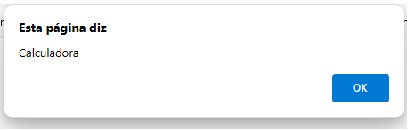
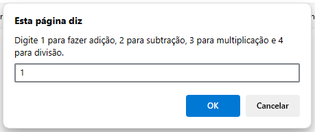
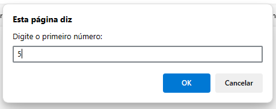
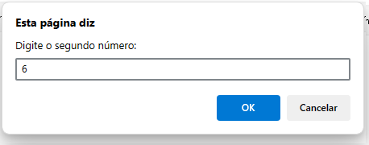
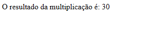
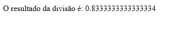

# javascript-Calculadora
calculadora feita no javascript só com prompt e o document.write. bem simplona.
  

  <h3>Primeiro vem prompts que pedem as seguintes informações pra fazer os cálculos.</h3>
  

  

  <h3>Aqui eu já fiz vários cálculos.</h3>
  

